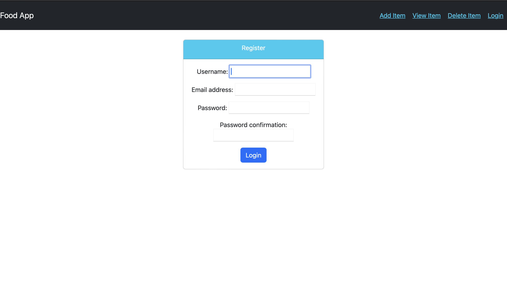
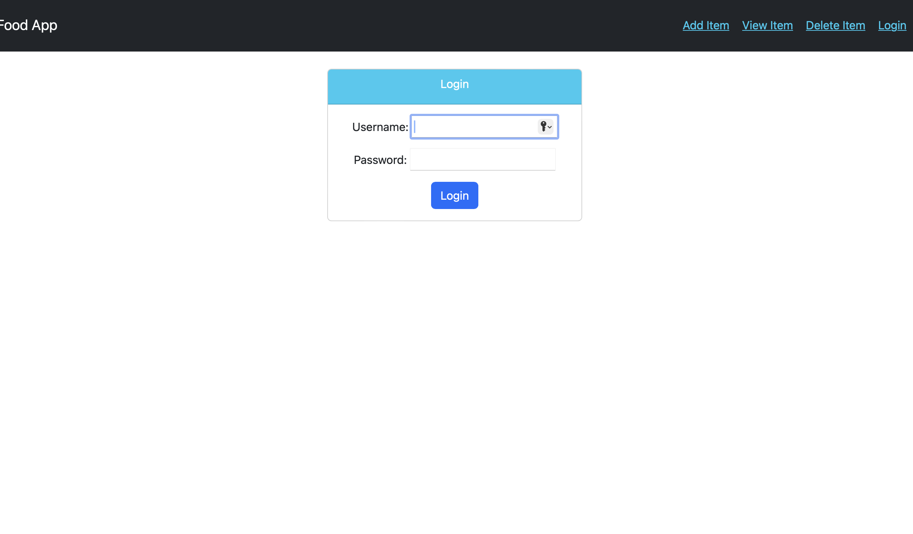

# A Food Web app

## Clone the repositary

```

### git clone <https://github.com/abhishek-sanwal/Food_Web_App.git>

```

### Install docker dekstop and run the container in detached mode

```
docker-compose up -d
```

### Now container is running and application should be hosted on localhost 8000 port.

### You can create a superuser for admin access using below command

```
python manage.py createsuperuser

```

Register page will be avaiable at http://127.0.0.1:8000/register/



Login page will be avaiable at http://127.0.0.1:8000/login/



Add item page will avaiable at http://127.0.0.1:8000/food/add


Product detaial page will be available at http://127.0.0.1:8000/food/<pk>/


Home page will be available at http://127.0.0.1:8000/food/


### You can spin down the docker container using following command

```
docker-compose down -d
```
